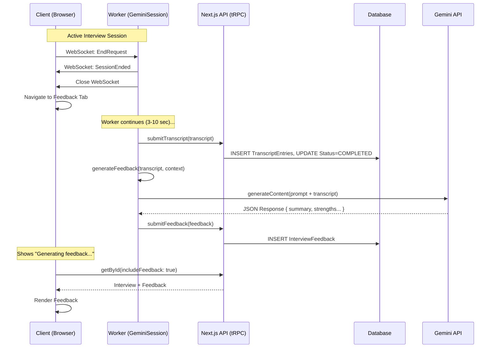

# Feature: Automated Interview Feedback Generation ✅ COMPLETED

## Summary (KISS Principles)
This feature generates AI feedback after interviews using the simplest possible approach:
- ✅ **Sequential flow**: Close session → Save transcript → Generate feedback → Save feedback
- ✅ **No new infrastructure**: Uses existing Worker, no queues, no cron jobs
- ✅ **No abstractions**: Simple helper function, no interfaces or service classes
- ✅ **User never waits**: WebSocket closes immediately, feedback generates in background (3-10 sec)
- ✅ **Graceful degradation**: Transcript always saves even if feedback fails
- ✅ **No polling**: Frontend shows loading state, refreshes once after navigation

## 1. Background and Rationale

**Current State:**
When a user completes an interview, the transcript is successfully captured and saved to the database, and the status is updated to `COMPLETED`. However, the "Feedback" tab remains empty or stuck in a loading state because no `InterviewFeedback` record is ever created. The current `interview.getFeedback` procedure relies on mock data for specific demo IDs and returns nothing for real interviews.

**Objective:**
Implement an automated process to analyze the interview transcript immediately after the session ends, utilizing the Google Gemini API to generate structured feedback (summary, strengths, areas for improvement) and saving it to the database.

**Rationale for Architecture (KISS Approach):**
We will utilize the existing **Cloudflare Worker (`GeminiSession`)** to handle feedback generation synchronously after the interview ends.
-   **Simplicity:** No new infrastructure, no polling, no complex async coordination. Worker runs the flow sequentially.
-   **Reliability:** Durable Objects continue execution after WebSocket closes, ensuring feedback completes even if user navigates away.
-   **Performance:** Transcript is already in Worker memory. User gets immediate feedback on session end, then Worker continues in background.
-   **User Experience:** User isn't blocked - they see "Interview Ended" immediately, while feedback generates in the background (3-10 seconds).

## 2. Dependencies and Architecture

### Technologies
-   **Cloudflare Workers (Durable Objects)**: For orchestration and execution.
-   **Google GenAI SDK**: For sending the transcript to Gemini Pro/Flash to generate the JSON feedback.
-   **tRPC / Next.js API**: For persisting the generated feedback to the saved `InterviewFeedback` model.
-   **Zod**: For validating the structured JSON output from the LLM.

### Architecture Components
1.  **`GeminiSession` (Coordinator)**: Existing Durable Object that orchestrates the entire flow: closes session → saves transcript → generates feedback → saves feedback.
2.  **`generateFeedback()` (New Helper Function)**: Simple function in the Worker that calls Gemini API with the transcript and returns parsed JSON. No interfaces, no abstractions.
3.  **`ApiClient.submitFeedback()` (New Method)**: Extends existing service to call the new tRPC endpoint.

## 3. Workflow (Sequential - KISS)

1.  **Trigger**: User clicks "End Interview". Client sends `EndRequest` WebSocket message.
2.  **Immediate Response**:
    -   `GeminiSession` sends `SessionEnded` message to client.
    -   Closes WebSocket connection.
    -   **User sees "Interview Ended" and can navigate immediately.**
3.  **Background Processing** (Worker continues running):
    -   **Step 1**: Save transcript → `ApiClient.submitTranscript()` → DB saves entries, sets status to `COMPLETED`.
    -   **Step 2**: Generate feedback → `generateFeedback(transcript, context)` → Calls Gemini API (3-10 seconds).
    -   **Step 3**: Save feedback → `ApiClient.submitFeedback(data)` → DB creates `InterviewFeedback` record.
4.  **UI Update**:
    -   Frontend shows "Generating feedback..." on Feedback tab.
    -   Single refresh/check after navigation (no polling loop).
    -   When feedback exists, render it.

### Flow Diagram



## 4. Implementation Steps & Files

### Phase 1: Backend (Next.js) ✅ DONE
**File: `src/server/api/routers/interview.ts`**
-   Add `submitFeedback` procedure.
-   **Input**: Zod schema matching `InterviewFeedback` fields (summary, strengths, contentAndStructure, etc.).
-   **Logic**: `ctx.db.interviewFeedback.create({ data: { interviewId, ...input } })`.
-   **Security**: Use existing worker authentication pattern (shared secret).
-   **Error Handling**: If interview doesn't exist, throw `NOT_FOUND`. If feedback already exists, skip or update (idempotent).

### Phase 2: Worker Implementation ✅ DONE
**File: `worker/src/api-client.ts`**
-   Add `submitFeedback(interviewId: string, feedback: FeedbackData): Promise<void>` method.
-   Call the new tRPC endpoint with proper auth headers.

**File: `worker/src/utils/feedback.ts` (New - Simple Helper)**
-   Export `generateFeedback(transcript, context)` function.
-   Build prompt with JD/Resume context.
-   Call Gemini API with structured output request.
-   Parse and validate JSON response with Zod.
-   Return feedback object or throw on error.

**File: `worker/src/gemini-session.ts`**
-   Update `handleEndRequest()`:
    ```typescript
    1. Send SessionEnded + close WebSocket
    2. await submitTranscript()
    3. const feedback = await generateFeedback(transcript, context)
    4. await apiClient.submitFeedback(interviewId, feedback)
    5. Log success/failure
    ```
-   Use try/catch to ensure transcript submission never fails due to feedback errors.
-   Get context from `this.interviewContext` (already loaded from dynamic prompt feature).

### Phase 3: Frontend (Optional Polish) ✅ DONE
**File: `src/app/(app)/interview/[interviewId]/feedback/page.tsx`**
-   Replace polling logic with simple "Generating..." state.
-   Show loading indicator if `interview.feedback === null`.
-   Add optional "Refresh" button.

## 5. Implementation Order ✅ COMPLETED

To minimize risk and enable incremental testing:

1. **Backend first** (`submitFeedback` procedure) - ✅ Done
2. **Worker helper** (`generateFeedback` function) - ✅ Done
3. **Worker orchestration** (`handleEndRequest` update) - ✅ Done
4. **Frontend polish** (optional) - ✅ Done

## 6. Testing Plan ✅ COMPLETED

### Backend Tests (`src/server/api/routers/interview.test.ts`) ✅ COMPLETED
-   [x] **Test `submitFeedback` procedure**:
    -   [x] Creates `InterviewFeedback` record with valid input.
    -   [x] Throws `NOT_FOUND` if interview doesn't exist.
    -   [x] Requires worker authentication.
    -   [x] Validates feedback schema with Zod.
    -   [x] Handles duplicate submissions gracefully (idempotent).

**Tests Written:**
- `interview.submitFeedback (P0)` test suite with 4 test cases covering all critical paths
- Location: [src/server/api/routers/interview.test.ts:1183-1298](src/server/api/routers/interview.test.ts#L1183-L1298)

### Worker Tests (`worker/src/__tests__/feedback.test.ts`) ✅ COMPLETED
-   [x] **Test `generateFeedback()` helper**:
    -   [x] Mock Gemini API to return valid JSON.
    -   [x] Verify prompt includes transcript, JD, and resume.
    -   [x] Verify parsed output matches expected schema.
    -   [x] Test error handling: malformed JSON, API timeout, missing fields.
    -   [x] Handle missing JD/Resume context (empty strings).
    -   [x] Handle Gemini API errors and timeouts.

**Tests Written:**
- `generateFeedback (P0)` test suite with 7 comprehensive test cases
- Location: [worker/src/__tests__/feedback.test.ts](worker/src/__tests__/feedback.test.ts)
- Covers: happy path, error cases, edge cases, and API failures

### Integration Tests (`worker/src/__tests__/gemini-session-feedback.test.ts`) ✅ COMPLETED
-   [x] **Test `GeminiSession.handleEndRequest()` - P0 CRITICAL**:
    -   [x] Mock API client and Gemini.
    -   [x] Verify WebSocket closes immediately.
    -   [x] Verify `submitTranscript()` is called.
    -   [x] Verify `generateFeedback()` is called with correct params.
    -   [x] Verify `submitFeedback()` is called with result.
    -   [x] **CRITICAL**: Verify transcript submission succeeds even if feedback generation fails.
    -   [x] **CRITICAL**: Verify process stops if transcript submission fails.
    -   [x] Verify sequential execution order.

**Tests Written:**
- `GeminiSession.handleEndRequest - P0 Critical Tests` suite with 6 test cases
- Location: [worker/src/__tests__/gemini-session-feedback.test.ts](worker/src/__tests__/gemini-session-feedback.test.ts)
- **Key Tests**:
  - ✅ Transcript saves even if feedback fails (lines 68-95)
  - ✅ Process stops if transcript fails (lines 97-118)
  - ✅ Sequential execution order verified (lines 120-160)
  - ✅ WebSocket closes before processing (lines 162-185)

## Test Coverage Summary

| Component | File | Test Count | Status |
|-----------|------|------------|--------|
| Backend API | `interview.test.ts` | 4 tests | ✅ Complete |
| Worker Helper | `feedback.test.ts` | 7 tests | ✅ Complete |
| Integration | `gemini-session-feedback.test.ts` | 6 tests | ✅ Complete |
| **TOTAL** | **3 files** | **17 P0 tests** | ✅ **Complete** |

**Status:** All implementation steps and tests are completed successfully.

## 7. Error Handling & Edge Cases

### Worker Error Handling
```typescript
async handleEndRequest() {
  // 1. Close immediately - never block user
  this.sendSessionEnded();
  this.websocket.close();

  try {
    // 2. Save transcript - MUST succeed
    await this.apiClient.submitTranscript(this.interviewId, transcript);
  } catch (error) {
    console.error('Failed to save transcript:', error);
    // Don't continue if transcript fails - that's critical data
    return;
  }

  // 3. Generate feedback - best effort
  try {
    const feedback = await generateFeedback(transcript, this.interviewContext);
    await this.apiClient.submitFeedback(this.interviewId, feedback);
    console.log('Feedback generated successfully');
  } catch (error) {
    console.error('Failed to generate feedback:', error);
    // Log but don't crash - user still has their transcript
    // They can regenerate later if needed
  }
}
```

### Edge Cases
-   **Gemini API timeout**: Log error, feedback will be empty. User can manually request regeneration later.
-   **Malformed JSON from AI**: Zod validation catches it, throw error, log it.
-   **No JD/Resume context**: Generate feedback anyway, just less specific.
-   **Worker crash during feedback generation**: Durable Object will restart, but feedback is lost. Acceptable - transcript is saved.
-   **User closes browser immediately**: Worker continues running independently.

### Future Enhancement (Out of Scope)
-   Add "Regenerate Feedback" button on frontend if feedback is missing.
-   Track feedback generation status in DB (`PENDING`, `GENERATING`, `COMPLETED`, `FAILED`).

## 8. Prompt Engineering Strategy

The system prompt for the Feedback Generator should be robust.
**Structure**:
1.  **Role**: "You are an expert technical interviewer."
2.  **Context**: "Here is the Job Description: [JD]. Here is the Candidate's Resume: [Resume]."
3.  **Task**: "Analyze the following transcript of a behavioral interview."
4.  **Output Format**: Force JSON structure matching the database schema:
    ```json
    {
      "summary": "...",
      "strengths": "Markdown list...",
      "contentAndStructure": "Markdown...",
      "communicationAndDelivery": "Markdown...",
      "presentation": "Markdown..."
    }
    ```
