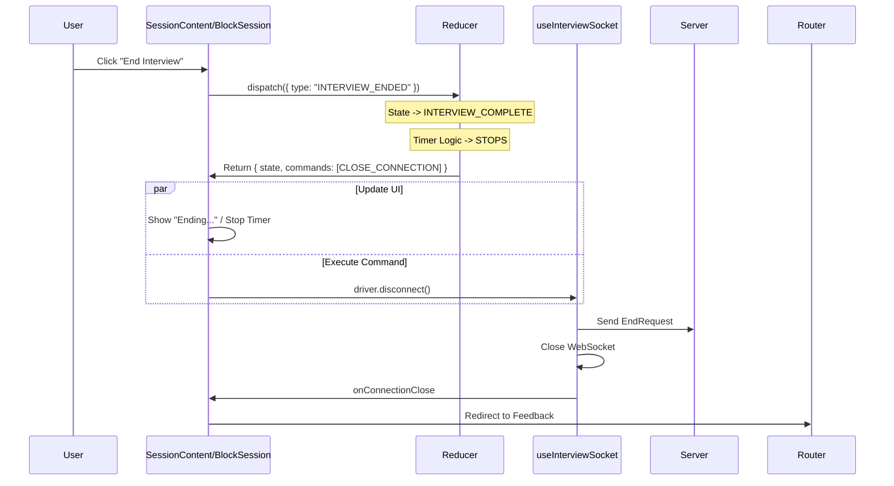

# FEAT27d: User Termination Experience (Intent-Based)

## Background: Relationship to FEAT27c

**FEAT27c was successfully implemented** (see [FEAT27c_v5_IMPLEMENTATION_COMPLETE.md](./FEAT27c_v5_IMPLEMENTATION_COMPLETE.md)) and achieved its goals:
- ✅ Separated business logic (reducer) from infrastructure (driver)
- ✅ Made `useInterviewSocket` a stateless "Dumb Driver"
- ✅ Implemented command/event pattern
- ✅ Made reducer pure and testable (48/48 tests passing)

**FEAT27c Foundation:**
```
sessionReducer (Pure Function)
  ↓ commands
useInterviewSocket (Stateless Driver)
  ↑ events
```

**What FEAT27c Did NOT Address:**
- Component architecture (where reducer instances live)
- Single source of truth (one vs multiple reducer instances)
- Complete usage of command pattern (infrastructure exists but not used everywhere)

**FEAT27d Builds On FEAT27c:**
FEAT27d is **Phase 2** of the architecture refactoring:
- FEAT27c = Separation of Concerns (reducer vs driver) ✅
- FEAT27d = Single Source of Truth (one reducer instance) ← This feature

**Why Both Are Needed:**
FEAT27c gave us the tools (pure reducer, command pattern), but multiple components still create their own reducer instances. FEAT27d ensures we use those tools correctly (one instance, complete handlers).

---

## Problem Statement

Currently, when a user clicks "End Interview":
1. `SessionContent` calls `driver.disconnect()` directly.
2. The WebSocket closes, and audio stops.
3. **Issue:** The `BlockSession` timer continues to tick until the navigation occurs or the connection close event bubbles up.
4. **Issue:** This creates a "Split Brain" or "Zombie" state where the connection is dead, but the UI (timer) thinks the session is still active.

### Issues Found Through User Testing

**Issue #1: Microphone doesn't turn off**
- Root cause: Button calls `driver.disconnect()` directly (imperative)
- Missing: `STOP_AUDIO` command generation in `INTERVIEW_ENDED` handler
- **FEAT27c provided:** Command pattern infrastructure
- **FEAT27d fixes:** Complete the event handler to use the infrastructure

**Issue #2: Timer discrepancy (Question: 1:00, Block: 0:40)**
- Root cause: Two reducer instances calculating timers independently
- When SessionContent's reducer resets `answerStartTime`, BlockSession's reducer doesn't know
- Result: 20 seconds lost
- **FEAT27c provided:** Pure reducer with correct timer logic
- **FEAT27d fixes:** Single reducer instance, calculate once

**Issue #3: Timers keep counting during connection errors**
- Root cause: `connectionState` and `status` are independent
- `CONNECTION_ERROR` sets `connectionState = "error"` but `status = "ANSWERING"` unchanged
- TICK handler continues processing because it checks `status`, not `connectionState`
- **FEAT27c provided:** Event handler for `CONNECTION_ERROR`
- **FEAT27d fixes:** Complete state transition (error should end session)

**Issue #4: State not centralized (Split Brain)**
- Root cause: BlockSession.tsx:90 and SessionContent.tsx:122 each create reducer instances
- Two independent state machines, no communication
- **FEAT27c provided:** Pure reducer that works correctly
- **FEAT27d fixes:** Lift state to parent, single instance

---

## Proposed Solution: Intent-Based Termination

We will shift from an imperative approach ("Disconnect the socket") to an intent-based approach ("User wants to end the interview").

### Core Concept
1. **User Action:** User clicks "End Interview".
2. **Intent:** Dispatch `INTERVIEW_ENDED` event to the reducer.
3. **State Transition:**
   - Reducer transitions state to `INTERVIEW_COMPLETE` (or a transitional `ENDING` state).
   - **Crucial:** Timers stop immediately because the state is no longer `ANSWERING`.
4. **Command Generation:** Reducer generates a `CLOSE_CONNECTION` command.
5. **Execution:** The "Dumb Driver" receives the command and terminates the connection.
6. **Navigation:** The UI reacts to the completed state and redirects the user.

### Architecture Flow



## Root Cause Analysis

**Split Brain Confirmed:**
- `BlockSession` creates its own reducer instance (BlockSession.tsx:90)
- `SessionContent` creates a separate reducer instance (SessionContent.tsx:122)
- Timer overlay in `BlockSession` reads from BlockSession's local state
- "End Interview" button in `SessionContent` calls `driver.disconnect()` directly
- Result: Connection closes, but BlockSession's reducer never knows → timer keeps ticking

**Architectural Decision:**
After first-principles analysis, the correct solution is **Option A: Lift State to Parent**. This ensures:
- ✅ Single source of truth (one reducer instance)
- ✅ Proper separation of concerns (container vs presentation)
- ✅ Reusability (controlled components)
- ✅ Testability (headless reducer tests + isolated UI tests)

## Implementation Plan

### Phase 1: Create Page-Level Container (Lift State)

**Objective:** Move reducer instance to the page level where interview lifecycle is managed.

**Files to modify:**
- `src/app/[locale]/(interview)/interview/[interviewId]/session/page.tsx`

**Implementation:**
1. Import `sessionReducer` and related types
2. Create single reducer instance at page level
3. Pass `state` and `dispatch` down to `BlockSession` or `SessionContent` based on `interview.isBlockBased`
4. Handle command execution at page level (or delegate to a command executor hook)

**Code structure:**
```typescript
export default function SessionPage({ params }) {
  const { data: interview } = api.interview.getById.useQuery(...)

  // Single source of truth - one reducer per interview session
  const [state, dispatch] = useReducer(sessionReducer, initialState, initContext)

  // Command executor (handles CLOSE_CONNECTION, etc.)
  useCommandExecutor(state.commands, driver)

  // Route based on interview mode
  if (interview.isBlockBased) {
    return <BlockSession state={state} dispatch={dispatch} {...props} />
  } else {
    return <SessionContent state={state} dispatch={dispatch} {...props} />
  }
}
```

### Phase 2: Convert BlockSession to Controlled Component

**Objective:** Remove BlockSession's local reducer, make it receive state/dispatch as props.

**Files to modify:**
- `src/app/[locale]/(interview)/interview/[interviewId]/session/BlockSession.tsx`

**Changes:**
1. **Remove** local reducer instance (lines 47-99)
2. **Add** props: `state: SessionState` and `dispatch: Dispatch<SessionEvent>`
3. **Update** all references from local `state` to prop `state`
4. **Update** all `dispatch()` calls to use prop `dispatch`
5. **Keep** context injection logic (blockDuration, answerTimeLimit) but move to parent or helper
6. **Keep** all presentation logic (timer overlays, block transition screens)

**Before:**
```typescript
const [state, dispatch] = useReducer(reducer, initialState)
```

**After:**
```typescript
interface BlockSessionProps {
  state: SessionState
  dispatch: Dispatch<SessionEvent>
  interview: {...}
  blocks: InterviewBlock[]
  template: InterviewTemplate
  guestToken?: string
}

export function BlockSession({ state, dispatch, ...props }) {
  // No local reducer - just presentation logic
}
```

### Phase 3: Convert SessionContent to Controlled Component

**Objective:** Make SessionContent support both controlled and standalone modes.

**Files to modify:**
- `src/app/[locale]/(interview)/interview/[interviewId]/session/SessionContent.tsx`

**Changes:**
1. **Add** optional props: `state?: SessionState` and `dispatch?: Dispatch<SessionEvent>`
2. **Keep** local reducer creation as fallback for standalone mode (backward compatible)
3. **Use** controlled state/dispatch if provided, otherwise use local instance
4. **Update** "End Interview" button (line 379):
   - **Before:** `onClick={() => driver.disconnect()}`
   - **After:** `onClick={() => dispatch({ type: "INTERVIEW_ENDED" })}`
5. **Remove** command execution logic if in controlled mode (parent handles it)

**Implementation:**
```typescript
interface SessionContentProps {
  interviewId: string
  guestToken?: string

  // Controlled mode props (optional)
  state?: SessionState
  dispatch?: Dispatch<SessionEvent>

  // Block mode overrides
  onSessionEnded?: () => void
  disableStatusRedirect?: boolean
  // ...
}

export function SessionContent(props) {
  // Support both controlled and standalone modes
  const isControlled = props.state !== undefined && props.dispatch !== undefined

  const [localState, localDispatch] = useReducer(
    sessionReducer,
    initialState,
    isControlled ? undefined : initContext
  )

  const state = isControlled ? props.state : localState
  const dispatch = isControlled ? props.dispatch : localDispatch

  // ... rest of component uses state/dispatch
}
```

### Phase 4: Implement INTERVIEW_ENDED Handler in Reducer

**Objective:** Add proper state machine transition for user-initiated termination.

**Files to modify:**
- `src/app/[locale]/(interview)/interview/[interviewId]/session/reducer.ts`

**Changes:**
1. Add `INTERVIEW_ENDED` event handler
2. Add state machine guards (only allow from valid states)
3. Transition to `INTERVIEW_COMPLETE` immediately
4. Generate `CLOSE_CONNECTION` command
5. Freeze timers (elapsedTime stops incrementing)

**Implementation:**
```typescript
case "INTERVIEW_ENDED": {
  // Guard: Only allow from ANSWERING or ANSWER_TIMEOUT_PAUSE
  if (state.status !== "ANSWERING" && state.status !== "ANSWER_TIMEOUT_PAUSE") {
    console.warn('Ignoring INTERVIEW_ENDED: invalid state', state.status)
    return { state, commands: [] }
  }

  return {
    state: {
      ...state,
      status: "INTERVIEW_COMPLETE",
      // Timer frozen at current value
      elapsedTime: state.elapsedTime,
    },
    commands: [{ type: "CLOSE_CONNECTION" }]
  }
}
```

**Also update TICK handler:**
```typescript
case "TICK": {
  // Don't update timers if interview is complete
  if (state.status === "INTERVIEW_COMPLETE") {
    return { state, commands: [] }
  }
  // ... rest of tick logic
}
```

### Phase 5: Add Lifecycle Safety & Concurrency Guards

**Objective:** Handle edge cases (unmount during disconnect, double-click, timeout).

**Changes:**
1. **Add timeout safety:** If `CLOSE_CONNECTION` command doesn't complete within 5s, force completion
2. **Add cleanup:** Ensure driver disconnects on component unmount regardless of state
3. **Add duplicate event guards:** Prevent multiple `INTERVIEW_ENDED` dispatches

**Implementation in page/container:**
```typescript
// Timeout safety
useEffect(() => {
  if (state.status === "INTERVIEW_COMPLETE") {
    const timeout = setTimeout(() => {
      console.warn('Connection close timeout, forcing navigation')
      router.push(feedbackUrl)
    }, 5000)

    return () => clearTimeout(timeout)
  }
}, [state.status])

// Cleanup on unmount
useEffect(() => {
  return () => {
    driver.disconnect()
    driver.dispose()
  }
}, [driver])
```

### Phase 6: Write Tests

**Objective:** Verify architecture with unit and integration tests.

**Test files to create:**
1. `reducer.test.ts` - Unit tests for reducer logic
2. `BlockSession.test.tsx` - Component tests with mock state
3. `SessionContent.test.tsx` - Component tests with mock state
4. `session-integration.test.ts` - E2E flow tests

**Test coverage:**
```typescript
// reducer.test.ts
describe('sessionReducer - INTERVIEW_ENDED', () => {
  it('transitions to INTERVIEW_COMPLETE from ANSWERING', () => {
    const state = reducer(answeringState, { type: 'INTERVIEW_ENDED' })
    expect(state.state.status).toBe('INTERVIEW_COMPLETE')
    expect(state.commands).toContainEqual({ type: 'CLOSE_CONNECTION' })
  })

  it('freezes elapsedTime on termination', () => {
    const before = { ...answeringState, elapsedTime: 120 }
    const after = reducer(before, { type: 'INTERVIEW_ENDED' })
    expect(after.state.elapsedTime).toBe(120)

    // TICK should not increment after complete
    const afterTick = reducer(after.state, { type: 'TICK' })
    expect(afterTick.state.elapsedTime).toBe(120)
  })

  it('ignores INTERVIEW_ENDED from INTERVIEW_COMPLETE state', () => {
    const state = reducer(completeState, { type: 'INTERVIEW_ENDED' })
    expect(state.state).toBe(completeState) // No change
    expect(state.commands).toEqual([]) // No new commands
  })
})

// BlockSession.test.tsx
describe('BlockSession - controlled component', () => {
  it('renders timer from provided state', () => {
    const mockState = { status: 'ANSWERING', elapsedTime: 600, ... }
    const mockDispatch = vi.fn()

    render(<BlockSession state={mockState} dispatch={mockDispatch} />)

    expect(screen.getByText(/10:00/)).toBeInTheDocument()
  })

  it('stops rendering timer when status is INTERVIEW_COMPLETE', () => {
    const mockState = { status: 'INTERVIEW_COMPLETE', ... }
    const mockDispatch = vi.fn()

    render(<BlockSession state={mockState} dispatch={mockDispatch} />)

    // Timer should not be rendered
    expect(screen.queryByText(/\d+:\d+/)).not.toBeInTheDocument()
  })
})

// SessionContent.test.tsx
describe('SessionContent - End Interview button', () => {
  it('dispatches INTERVIEW_ENDED when clicked', () => {
    const mockDispatch = vi.fn()
    const mockState = { status: 'ANSWERING', ... }

    render(<SessionContent state={mockState} dispatch={mockDispatch} />)

    const endButton = screen.getByText('End Interview')
    fireEvent.click(endButton)

    expect(mockDispatch).toHaveBeenCalledWith({ type: 'INTERVIEW_ENDED' })
  })
})
```

### Phase 7: Verification & Cleanup

**Manual testing:**
1. **Test:** Click "End Interview" → Timer stops immediately (no zombie tick)
2. **Test:** Connection closes within 1 second
3. **Test:** User is redirected to feedback page
4. **Test:** Double-click "End Interview" → No duplicate requests (guard works)
5. **Test:** Navigate away during ANSWERING → Cleanup happens (no memory leak)

**Cleanup:**
1. Remove `onSessionEnded` callback prop (no longer needed with shared state)
2. Remove unused code comments referencing old architecture
3. Update documentation in component files
4. Run `pnpm format && pnpm check`

## Success Criteria
- [ ] Timer overlay in `BlockSession` disappears or stops immediately when "End Interview" is clicked.
- [ ] No "zombie" state where UI is active but connection is dead.
- [ ] "End Interview" acts as a definitive state change, not just a side effect.
- [ ] Microphone turns off immediately when ending interview
- [ ] Timers stop immediately when connection error occurs
- [ ] All 4 user-reported issues are resolved

---

## What Changes vs What Stays (FEAT27c Context)

### Keeps from FEAT27c (No Changes)

**✅ Pure Reducer**
- `sessionReducer.ts` remains a pure function
- Command/event pattern infrastructure stays
- All 48 existing tests continue to pass

**✅ Stateless Driver**
- `useInterviewSocket.ts` remains stateless
- Driver interface unchanged (connect, disconnect, mute, unmute)
- Event callbacks unchanged

**✅ Type System**
- `types.ts` command definitions stay
- `ReducerResult { state, commands }` pattern stays
- Event types stay

**What we're NOT doing:**
- ❌ NOT reverting FEAT27c
- ❌ NOT changing reducer to driver relationship
- ❌ NOT adding state back to the hook

### Adds in FEAT27d (New Changes)

**✅ Component Architecture**
- NEW: Page-level container with single reducer instance
- NEW: BlockSession becomes controlled component (accepts state/dispatch props)
- NEW: SessionContent supports controlled mode (backward compatible)

**✅ Complete Event Handlers**
- UPDATE: `INTERVIEW_ENDED` generates `STOP_AUDIO` + `CLOSE_CONNECTION` commands
- UPDATE: `CONNECTION_ERROR` transitions `status` to `INTERVIEW_COMPLETE`
- UPDATE: `TICK` handler early-returns when `status === "INTERVIEW_COMPLETE"`

**✅ Centralized Calculations**
- NEW: Timer calculations happen once at page level
- NEW: Calculated timers passed to children as props
- NEW: No duplicate calculations

**✅ State Machine Guards**
- NEW: Guard against duplicate `INTERVIEW_ENDED` events
- NEW: Timeout safety if connection doesn't close
- NEW: Cleanup on component unmount

### Architecture Evolution

```
Phase 1: FEAT27c (Completed)
┌─────────────────────────────────────┐
│ BlockSession                        │
│ ├─ useReducer(sessionReducer) ✅    │ ← Created by FEAT27c
│ └─ useInterviewSocket(events) ✅    │ ← Made stateless by FEAT27c
│                                     │
│ SessionContent                      │
│ ├─ useReducer(sessionReducer) ✅    │ ← Created by FEAT27c
│ └─ useInterviewSocket(events) ✅    │ ← Made stateless by FEAT27c
└─────────────────────────────────────┘
Problem: Two reducer instances (Split Brain)

Phase 2: FEAT27d (This Feature)
┌─────────────────────────────────────┐
│ SessionPage                         │
│ ├─ useReducer(sessionReducer) ✅    │ ← LIFT from children
│ ├─ calculateTimers() ✅             │ ← NEW: Centralize
│ ├─ useCommandExecutor() ✅          │ ← NEW: Execute commands
│ └─ useInterviewSocket(events) ✅    │ ← STAYS from FEAT27c
│                                     │
│ BlockSession (Controlled)           │
│ └─ Props: { state, dispatch }      │ ← NEW: Controlled
│                                     │
│ SessionContent (Controlled)         │
│ └─ Props: { state, dispatch }      │ ← NEW: Controlled
└─────────────────────────────────────┘
Solution: Single reducer instance ✅
```

### Summary Table

| Aspect | FEAT27c Status | FEAT27d Changes |
|--------|---------------|----------------|
| Reducer purity | ✅ Pure function | Keep unchanged |
| Driver statefulness | ✅ Stateless | Keep unchanged |
| Command pattern | ✅ Infrastructure exists | Complete usage |
| Event pattern | ✅ Infrastructure exists | Keep unchanged |
| Reducer instances | ❌ Multiple (Split Brain) | ✅ Single (Lift to parent) |
| Timer calculations | ❌ Multiple places | ✅ Once at top level |
| State transitions | ⚠️ Incomplete handlers | ✅ Complete handlers |
| Component architecture | ❌ Not addressed | ✅ Container/Presentation |

**Key Insight:** FEAT27d doesn't replace FEAT27c, it completes it by ensuring the tools FEAT27c created are used correctly.
