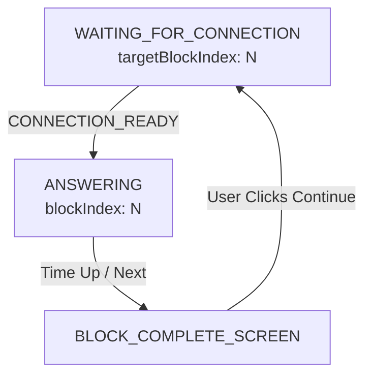

# FEAT40: Unified Block Isolation Strategy

> **Status:** Verified (Revised v3 - KISS)
> **Verified:** 2025-12-31
> **Supersedes:** FEAT36, FEAT38, FEAT39
> **Related:** FEAT34 (Simplify Timing)

## Problem Statement

Block-based interviews currently face critical stability issues during transitions:
1.  **Session Leaks:** The same server-side session (Durable Object) is reused across blocks, causing timeout pollution and context bleed.
2.  **Race Conditions:** Transitioning directly to `ANSWERING` state while reconnecting creates a window where timers fire before the connection is ready.
3.  **Ambiguous Closures:** WebSocket disconnects during transitions look like errors to the client, causing "Connection Lost" false positives.

## System Hierarchy

Understanding the architectural layers is critical to this design:

```
Interview (PostgreSQL)
├── id, userId, jobDescription, resume, duration, status
├── createdAt, completedAt
└── Blocks[] (1..N, defined by interview template)
    │
    ▼
Block (Durable Object)
├── Unique ID: ${interviewId}_block${blockNum}
├── Holds: systemPrompt, timeLimit, conversationHistory
├── Server-authoritative timer
└── Ephemeral (destroyed after block ends)

Worker Entry Point (Stateless)
├── Routes: /{interviewId}?token=...&block=N
├── Validates JWT
└── Forwards to correct DO via idFromName()

Frontend State Machine (Browser, Ephemeral)
├── UI coordination: WAITING → ANSWERING → BLOCK_COMPLETE → ...
├── Timer display (derived from server events)
├── Transcript buffer
└── Issues commands to Driver
```

**Key Insight:** The worker entry point is a **stateless router**. The Durable Object holds **block-scoped state**. The frontend state machine is **ephemeral UI coordination**.

## First Principles Analysis

### 1. The Server Reality
A "Block" is an independent unit of time and context. It has a specific system prompt, a specific time limit, and a fresh start.
*   *Principle:* **1 Block = 1 Durable Object.**

### 2. The Hardware Driver Pattern
The WebSocket driver should be a "dumb pipe" - it exposes methods and emits events but never makes business decisions.
*   *Principle:* **Driver always emits events. Driver never swallows events.**

### 3. Single Point of Filtering
The driver's stale socket guard (`wsRef.current !== ws`) is the **only** filter needed. If an event passes this guard, it's from the current socket and must be handled—even during reconnection.
*   *Principle:* **One guard, at the driver. No redundant guards in the reducer.**
*   *Anti-pattern:* "Double guard" where reducer also ignores events based on state, creating blind spots for legitimate failures.

### 4. The Client State Machine
A state should imply its invariants.
*   `ANSWERING` implies "I can speak and am being timed."
*   `WAITING_FOR_CONNECTION` implies "I am connecting or reconnecting."
*   *Principle:* **Reuse `WAITING_FOR_CONNECTION` for all connection phases.**

### 5. Stale Socket Isolation
When reconnecting, the old socket may fire events after the new socket is active. The driver must ignore events from stale sockets.
*   *Principle:* **Only emit events from the current socket.**

### 6. The Double Guard Trap (Anti-Pattern)
If the driver filters stale sockets, the reducer should NOT also ignore events based on state. Two guards create a blind spot.

**The Trap:**
```
Driver guard: wsRef.current !== ws → filters old socket events
Reducer guard: status === WAITING → ignores all close events
Result: New socket failures during WAITING are ignored → infinite spinner
```

*   *Principle:* **One guard is sufficient. Two guards create blind spots.**

### 7. Audio/Network Separation
Audio is between User and Hardware (microphone/speaker). Network is between Hardware and Backend. These are independent concerns.
*   *Principle:* **Audio (User ↔ Hardware) should not know about WebSocket (Hardware ↔ Backend).**
*   *Implication:* Reconnecting to a new block should swap the network layer without touching the microphone.

## Solution Architecture

### 1. Backend: True Isolation (DONE)
Each block gets its own Durable Object. This is already implemented in `worker/src/index.ts:99`:
```typescript
const id = env.GEMINI_SESSION.idFromName(`${interviewId}_block${block}`);
```

### 2. Frontend Driver: Dumb Pipe
The driver ALWAYS emits `onConnectionClose(code)`. It never interprets or swallows events.

**Before (Current - Violates Dumb Driver):**
```typescript
ws.onclose = (event) => {
  switch (event.code) {
    case WS_CLOSE_USER_INITIATED:
      events.onConnectionClose(event.code);  // Driver decides: "normal"
      break;
    case WS_CLOSE_ERROR:
      events.onConnectionError("Session error");  // Driver decides: "error"
      break;
    default:
      events.onConnectionError("Connection lost");  // Driver decides: "unknown = error"
  }
};
```

**After (Correct - Dumb Pipe with Stale Socket Guard):**
```typescript
const connectWebSocket = useCallback((token: string) => {
  // Close existing connection
  if (wsRef.current) {
    wsRef.current.close(4005, "Block transition");
    wsRef.current = null;
  }

  const ws = new WebSocket(wsUrl);
  wsRef.current = ws;

  ws.onopen = () => {
    if (wsRef.current !== ws) return;  // Stale socket, ignore
    events.onConnectionOpen();
  };

  ws.onclose = (event) => {
    if (wsRef.current !== ws) {
      console.log(`[WebSocket] Ignoring close from stale socket`);
      return;  // Stale socket, ignore
    }
    console.log(`[WebSocket] Closed with code ${event.code}: ${event.reason}`);
    events.onConnectionClose(event.code);  // Always emit, pass raw code
  };

  ws.onerror = () => {
    if (wsRef.current !== ws) return;  // Stale socket, ignore
    events.onConnectionError("Connection error");
  };

  ws.onmessage = (event) => {
    if (wsRef.current !== ws) return;  // Stale socket, ignore
    // ... handle message
  };
}, [...]);
```

**Key Insight:** The closure captures `ws` (the specific socket instance). Comparing `wsRef.current !== ws` detects if events are from a stale socket that was replaced during reconnection.

### 3. Frontend State Machine: Handle All Current Socket Events
The reducer handles ALL events that pass the driver's stale socket guard.

**Key Insight:** If an event reaches the reducer, it's from the **current** socket (the driver filtered stale events). The reducer must handle it, even during `WAITING_FOR_CONNECTION`.

**Anti-Pattern (Double Guard Trap):**
```typescript
// BAD: Creates blind spot for connection failures during reconnection
case "CONNECTION_CLOSED":
  if (state.status === "WAITING_FOR_CONNECTION") {
    return { state, commands: [] };  // WRONG: Ignores legitimate failures
  }
```

**Correct Pattern:**
```typescript
case "CONNECTION_CLOSED":
  // If we're here, the event passed the driver's stale socket guard,
  // meaning it's from the CURRENT socket. Always handle it.
  const isError = event.code === WS_CLOSE_ERROR ||
                  (event.code < 4000 && event.code !== 1000);

  // Connection failed while waiting = error (new socket failed to connect)
  // Note: We use INTERVIEW_COMPLETE with connectionState: "error" (not a separate CONNECTION_ERROR status)
  if (isError || state.status === "WAITING_FOR_CONNECTION") {
    return {
      state: { ...state, status: "INTERVIEW_COMPLETE", connectionState: "error", error: "Connection failed" },
      commands: [{ type: "STOP_AUDIO" }],
    };
  }

  // Normal close while ANSWERING = block complete or user-initiated
  return { state: { ...state, connectionState: "ending" }, commands: [] };
```

**Why This Works:**
- Old socket closes → Filtered by driver (`wsRef.current !== ws`) → Never reaches reducer
- New socket fails → Passes driver guard → Reducer handles as error
- No blind spots, no infinite spinners

### 4. The Unified Waiting Loop
Instead of transitioning `BLOCK_COMPLETE_SCREEN` → `ANSWERING` (race condition), we go through `WAITING_FOR_CONNECTION`:



**State Transitions:**
```
BLOCK_COMPLETE_SCREEN + USER_CLICKED_CONTINUE
  → WAITING_FOR_CONNECTION { targetBlockIndex: N }
  → emit RECONNECT_FOR_BLOCK command
  → Driver closes old connection (code 4005)
  → Old socket's onclose fires
  → Driver ignores (wsRef.current !== oldWs, stale socket guard)
  → New connection opens
  → CONNECTION_READY event
  → ANSWERING { blockIndex: N, blockStartTime: now, answerStartTime: now }

Alternative: New connection FAILS
  → WAITING_FOR_CONNECTION { targetBlockIndex: N }
  → emit RECONNECT_FOR_BLOCK command
  → Driver closes old connection, creates new socket
  → New socket fails (bad token, network error)
  → New socket's onclose fires
  → Driver emits (wsRef.current === newWs, passes guard)
  → CONNECTION_CLOSED event reaches reducer
  → Reducer transitions to INTERVIEW_COMPLETE with connectionState: "error" (not ignored!)
```

### 5. Close Code 4005: Optional Logging
The `WS_CLOSE_BLOCK_RECONNECT = 4005` constant is useful for debugging/logging, but is NOT used for control flow.

```typescript
// In reconnectForBlock - 4005 for debugging visibility only
wsRef.current.close(4005, "Block transition");
```

The reducer does NOT check for 4005. It guards based on state.

### 6. Hot Mic: Keep AudioSession Alive (KISS Approach)

**Current Problem:** Audio and WebSocket lifecycles are tightly coupled. When reconnecting, the microphone is torn down and re-initialized, causing the browser's recording indicator to flash.

**Current Architecture (Coupled):**
```
┌─────────────────────────────────────────────────────────┐
│ AudioSession                                            │
│  ├── AudioRecorder (owns MediaStream)                   │
│  │    └── onAudioData callback → sends to socket        │
│  └── stop() → releases MediaStream                      │
└─────────────────────────────────────────────────────────┘

On block transition:
  audioSessionRef.current?.stop();  // ← KILLS MICROPHONE
  audioSessionRef.current = null;
```

**New Architecture (Inline Check - No New Abstraction):**
```
┌─────────────────────────────────────────────────────────┐
│ AudioSession (User ↔ Hardware) ─ PERSISTENT             │
│  ├── AudioRecorder (owns MediaStream)                   │
│  │    └── onAudioData → checks wsRef.current → sends    │
│  └── AudioPlayer (speaker output)                       │
└─────────────────────────────────────────────────────────┘

On block transition:
  wsRef.current?.close(4005, "Block transition");
  wsRef.current = null;
  // DON'T call audioSession.stop() - mic stays hot
  // Audio chunks silently dropped until new socket opens
```

**Implementation (Inline in useInterviewSocket):**
```typescript
// When starting audio (once per interview, NOT per block)
audioSession.start({
  onAudioData: (chunk: ArrayBuffer) => {
    // Check socket directly - no separate router class needed
    if (wsRef.current?.readyState === WebSocket.OPEN) {
      wsRef.current.send(encodeAudioChunk(chunk));
    }
    // Otherwise silently drop (mic stays hot, chunks dropped during transition)
  }
});

// On block transition - close socket, DON'T stop audio
wsRef.current?.close(4005, "Block transition");
wsRef.current = null;
// audioSession stays alive - mic stays hot

// On interview end - full teardown
audioSession.stop();
```

**Block Transition Flow (New):**
```
OLD: audioSessionRef.current?.stop();   // Kills microphone
NEW: (nothing)                          // Just close socket, audio keeps running

OLD: setupAudio();                      // Re-acquires microphone permission
NEW: (nothing)                          // Audio already running, new socket opens
```

**Why No AudioRouter Class (KISS):**
- Single use case doesn't justify a new abstraction
- Inline socket check achieves the same "hot mic" behavior
- Fewer files, less indirection, same outcome
- Can always add AudioRouter later if multiple audio destinations needed

**Benefits:**
- Microphone stays "hot" between blocks
- No browser permission re-prompts
- No recording indicator flash
- Network-only reconnection (~100ms vs ~500ms+)
- **Zero new files or abstractions**

## Implementation Plan

### Phase 1: Constants
- [x] Backend DO isolation already implemented (`${interviewId}_block${block}`)
- [ ] Add `WS_CLOSE_BLOCK_RECONNECT = 4005` to `src/lib/constants/interview.ts` (for logging)

### Phase 2: Driver Simplification
- [ ] Add stale socket guard to all event handlers (`wsRef.current !== ws`)
- [ ] Simplify `onclose` handler to always emit (remove switch statement)
- [ ] Simplify `onerror` handler (just emit, no message interpretation)
- [ ] Remove all close code interpretation from driver
- [ ] Use 4005 in close calls for logging clarity

### Phase 3: Audio Persistence (Inline - No New Files)
- [ ] Modify `onAudioData` callback to check `wsRef.current?.readyState` before sending
- [ ] Remove `audioSession.stop()` calls during block transitions
- [ ] Keep `audioSession.stop()` only for interview end (full teardown)
- [ ] Keep `AudioSession` alive across block transitions

### Phase 4: State Machine Updates

#### 4a. Types (`types.ts`)
- [ ] Update `WAITING_FOR_CONNECTION` state to include optional `targetBlockIndex`
```typescript
| ({ status: "WAITING_FOR_CONNECTION"; targetBlockIndex?: number } & CommonStateFields)
```

#### 4b. Reducer (`reducer.ts`)
- [ ] Update `BLOCK_COMPLETE_SCREEN` + `USER_CLICKED_CONTINUE`:
  - Transition to `WAITING_FOR_CONNECTION` (not `ANSWERING`)
  - Set `targetBlockIndex`
  - Emit `RECONNECT_FOR_BLOCK` command

- [ ] Update `WAITING_FOR_CONNECTION` + `CONNECTION_READY`:
  - Transition to `ANSWERING`
  - Use `targetBlockIndex` for `blockIndex`
  - Set fresh `blockStartTime` and `answerStartTime`

- [ ] Update `CONNECTION_CLOSED` handler:
  - Handle ALL close events (no state-based ignore)
  - If error code OR in `WAITING_FOR_CONNECTION`: transition to `INTERVIEW_COMPLETE` with `connectionState: "error"`
  - Otherwise: normal close handling

### Phase 5: Tests
- [ ] Add reducer tests for block transition flow
- [ ] Verify stale socket events are filtered by driver (never reach reducer)
- [ ] Verify new socket failures during WAITING cause `INTERVIEW_COMPLETE` with `connectionState: "error"`
- [ ] Verify close events cause error while in ANSWERING state
- [ ] Verify microphone stays active across block transitions (manual testing)

## Verification Scenarios

### 1. The "Happy Path" Loop
```
Start Interview → Block 1 → ANSWERING
Wait for timeout → BLOCK_COMPLETE_SCREEN
Click Continue → WAITING_FOR_CONNECTION (targetBlockIndex: 1)
Connection ready → ANSWERING (blockIndex: 1)
Verify: Timer starts at 0 for Block 2
```

### 2. The "Ghost" Check (Backend Isolation)
```
Start Block 1 → ANSWERING
Wait 30s
Force complete → BLOCK_COMPLETE_SCREEN
Continue → Block 2 → ANSWERING
Wait 30s (Total 60s)
Verify: Block 1's DO timeout does NOT affect Block 2
```

### 3. The "Race" Check (Stale Socket Close During Transition)
```
Block 1 complete → Click Continue
State: WAITING_FOR_CONNECTION
Old socket's onclose fires (stale)
Verify: Driver ignores (wsRef.current !== oldWs)
Verify: Reducer never receives CONNECTION_CLOSED
New connection ready → ANSWERING
```

### 4. The "Panic" Check (Real Network Error While Answering)
```
While in ANSWERING, network drops (code 1006)
Verify: CONNECTION_CLOSED event triggers error handling
Verify: Shows Error Screen
```

### 5. The "Failed Reconnect" Check (New Socket Fails)
```
Block 1 complete → Click Continue
State: WAITING_FOR_CONNECTION
New socket created, immediately fails (bad token, server down)
New socket's onclose fires (wsRef.current === newWs, passes guard)
Verify: Reducer receives CONNECTION_CLOSED
Verify: Reducer transitions to INTERVIEW_COMPLETE with connectionState: "error" (not stuck on spinner!)
```

### 6. The "Stale Socket" Check (Fast Reconnection)
```
Block 1 complete → Click Continue
State: WAITING_FOR_CONNECTION
New connection opens FAST → ANSWERING
Old connection closes LATE (stale socket)
Verify: Driver ignores stale close (wsRef.current !== ws)
Verify: State remains ANSWERING (no error)
```

### 7. The "Hot Mic" Check (Audio Persistence)
```
Start Interview → Block 1 → ANSWERING
Verify: Recording indicator is ON
Block 1 complete → Click Continue
State: WAITING_FOR_CONNECTION
Verify: Recording indicator stays ON (mic not released)
New connection ready → ANSWERING (Block 2)
Verify: Recording indicator still ON (same MediaStream)
Interview complete → Full teardown
Verify: Recording indicator is OFF
```

### 8. Headless Testability (Litmus Test)
```typescript
// Can test entire flow without React or WebSocket
const state1 = reducer(blockCompleteState, { type: "USER_CLICKED_CONTINUE" }, ctx);
expect(state1.state.status).toBe("WAITING_FOR_CONNECTION");
expect(state1.state.targetBlockIndex).toBe(1);

// Close event during WAITING = connection failed (not ignored!)
const state2 = reducer(state1.state, { type: "CONNECTION_CLOSED", code: 1006 }, ctx);
expect(state2.state.status).toBe("INTERVIEW_COMPLETE");  // NOT WAITING!
expect(state2.state.connectionState).toBe("error");
expect(state2.state.error).toBe("Connection failed");

// Happy path: connection ready transitions to ANSWERING
const state3 = reducer(state1.state, { type: "CONNECTION_READY", initialBlockIndex: 1 }, ctx);
expect(state3.state.status).toBe("ANSWERING");
expect(state3.state.blockIndex).toBe(1);
```

**Note:** Stale socket filtering happens at the driver layer, not the reducer. The reducer tests assume events have already passed the driver's guard.

### 9. Hot Mic Manual Test
```
1. Start interview → Block 1 → ANSWERING
2. Observe: Browser recording indicator is ON
3. Complete Block 1 → Click Continue
4. Observe: Recording indicator stays ON (no flash)
5. Block 2 starts → ANSWERING
6. Observe: Recording indicator still ON (same MediaStream)
7. Complete interview
8. Observe: Recording indicator turns OFF
```

**Pass Criteria:** Recording indicator never flashes off during block transitions.

## Design Comparison

| Aspect | Original FEAT40 | Revised v1 | Revised v2 | **v3 KISS (Current)** |
|--------|-----------------|------------|------------|------------------------|
| Guard location | Driver (swallows 4005) | Reducer (checks state) | Driver only (stale socket) | Driver only (stale socket) |
| Close event flow | 4005 → swallowed | All → reducer ignores in WAITING | All → reducer handles all | All → reducer handles all |
| WAITING + close | N/A | Ignored (blind spot!) | Error state | `INTERVIEW_COMPLETE` + `connectionState: "error"` |
| 4005 purpose | Control flow | Logging only | Logging only | Logging only |
| Driver role | Protocol-aware | Dumb pipe | Dumb pipe + stale guard | Dumb pipe + stale guard |
| Stale socket handling | None | Driver filters | Driver filters | Driver filters |
| Double guard trap | N/A | YES (bug) | NO (fixed) | NO (fixed) |
| Audio lifecycle | Coupled to socket | Coupled to socket | Decoupled (AudioRouter) | **Inline check (no class)** |
| Mic on transition | Torn down | Torn down | Stays hot | Stays hot |
| New files | N/A | N/A | 1 (AudioRouter.ts) | **0** |
| Testability | Can't test 4005 | Testable but wrong | Fully correct | Fully correct |

## Race Condition Summary

| Race Condition | Solution | Layer |
|----------------|----------|-------|
| Stale socket events | Socket identity check (`wsRef.current !== ws`) | Driver |
| New socket fails during reconnect | Reducer transitions to `INTERVIEW_COMPLETE` with `connectionState: "error"` | Reducer |

**Single Guard Architecture:** The driver's stale socket check is the **only** filter. No redundant state-based ignoring in the reducer.

## Trade-offs and Future Improvements

### Trade-off: Isolation vs. UX Latency

Destroying and recreating the WebSocket connection for every block introduces some latency.

**Impact:** Users will see a brief "Connecting..." spinner between blocks.

**Mitigations (Included in This Design):**
1. **Hot Mic** - Microphone stays active, no hardware re-initialization (~300ms saved)
2. **Network-only reconnection** - Only WebSocket is torn down, not audio pipeline

**Remaining Latency:** ~100-200ms for WebSocket handshake + DO cold start (acceptable)

**Future Optimization (Optimistic Warm-up) - NOT INCLUDED:**
Pre-connect to next block while user is on `BLOCK_COMPLETE_SCREEN`:
```typescript
// On BLOCK_COMPLETE_SCREEN entry
const nextBlockToken = await fetchToken(interviewId, nextBlockIndex);
const warmSocket = new WebSocket(buildUrl(nextBlockToken));
// Store in ref, promote to primary when user clicks Continue
```

**Why Deferred:**
- Adds complexity (managing hidden "warm" socket)
- Token might expire if user takes too long
- Current latency is acceptable with hot mic optimization
- Implement only if user feedback indicates latency is still a problem

### Future: When to Add AudioRouter Class

If any of these become true, consider extracting an AudioRouter class:
- Multiple audio destinations needed (e.g., local recording + network)
- Need to buffer audio during reconnection (currently chunks are dropped)
- Need audio routing metrics/logging separate from session
- Need to route audio to different backends dynamically

Until then, the inline check is simpler and sufficient.

## References

*   [FEAT38: Block Reconnect Close Code](./FEAT38_block_reconnect_close_code.md) - Original 4005 idea (revised here)
*   [FEAT39: Block Session Isolation](./FEAT39_block_session_isolation.md) - DO isolation (already implemented)
*   [Golden Path Architecture](../../src/app/[locale]/(interview)/interview/[interviewId]/session/README.md) - Architectural standard
